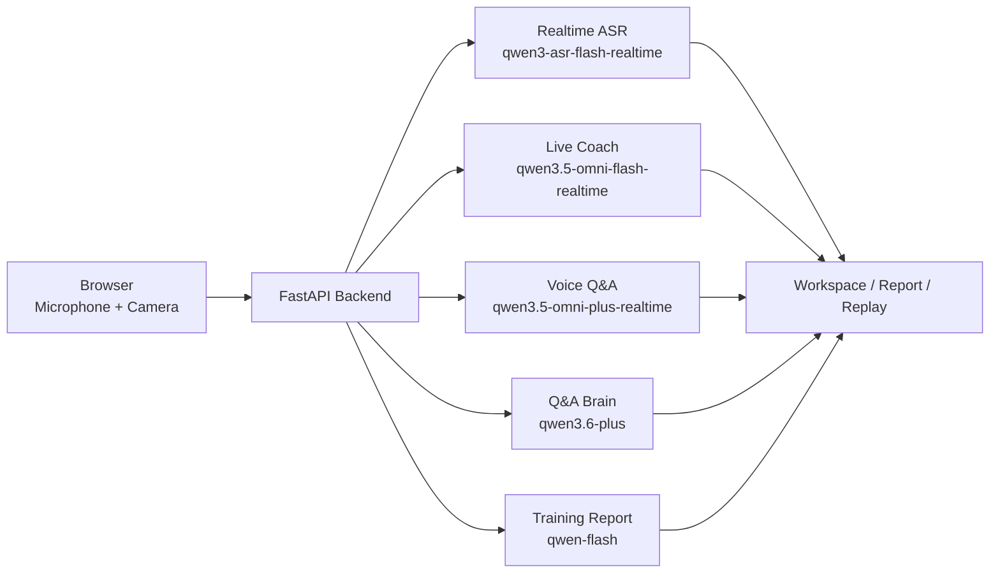

# Speak Up

[简体中文](README.md) | English

[](LICENSE)

Speak Up is an AI speech-training web prototype. It connects realtime transcription, delivery feedback, AI follow-up questions, replay review, and final reports into one practice loop, so each session becomes feedback that users can review and improve from.

## Features

- Free speech and document-based speech training modes.
- Browser microphone and camera capture, with realtime transcripts and coach feedback from the backend.
- AI Q&A mode asks follow-up questions, evaluates answers, and supports voice interaction.
- After each practice session, Speak Up generates a structured report and a replay page with synchronized video, transcript, and feedback markers.

## Repository Structure

```text
speak_up/
├── frontend/                  # Next.js frontend
├── backend/                   # FastAPI backend
├── ai_coach/profiles.json     # AI coach profiles
├── demo_image/                # README screenshots
└── .env.example               # Example environment variables
```

## UI Preview

### Main Training Page


### AI Q&A


### Replay Review


### Training Suggestions


## AI Pipeline



The real AI path shares one `DASHSCOPE_API_KEY`. The model names below already have defaults; only set the optional variables if you want to override a model.

| Capability | Default model | What it does | Optional env var |
| --- | --- | --- | --- |
| Realtime ASR | `qwen3-asr-flash-realtime` | Converts microphone audio into live transcripts | `ALIYUN_REALTIME_ASR_MODEL` |
| Live Coach | `qwen3.5-omni-flash-realtime` | Produces speech, pacing, and body-language feedback from audio and camera frames | `ALIYUN_OMNI_COACH_MODEL` |
| Voice Q&A | `qwen3.5-omni-plus-realtime` | Runs the voice interviewer and follow-up dialogue | `ALIYUN_QA_OMNI_MODEL` |
| Q&A Brain | `qwen3.6-plus` | Summarizes source material, generates questions, and evaluates answers | `ALIYUN_QA_BRAIN_MODEL` |
| Q&A TTS | `qwen3-tts-instruct-flash-realtime` | Generates the AI interviewer voice | `ALIYUN_QA_TTS_MODEL` |
| Report Windows | `qwen-flash` | Summarizes performance over short report windows | `ALIYUN_REPORT_WINDOW_MODEL` |
| Final Report | `qwen-flash`, fallback `qwen-plus-latest` | Builds the final session report and suggestions | `ALIYUN_REPORT_BRAIN_MODEL`, `ALIYUN_REPORT_BRAIN_FALLBACK_MODEL` |

## Local Development

The backend does not load a `.env` file automatically. Put variables in your current shell or process manager. The minimum setup is:

```bash
export DASHSCOPE_API_KEY=sk-...
export SPEAK_UP_INTERNAL_ACCOUNTS='[{"account":"demo","password":"change-me","displayName":"Demo User"}]'
```

`DASHSCOPE_API_KEY` is used for Alibaba Cloud DashScope model calls. `SPEAK_UP_INTERNAL_ACCOUNTS` is the local internal account pool; do not commit real account credentials.

Start the backend:

```bash
cd backend
python -m venv .venv
. .venv/bin/activate
pip install -r requirements.txt
uvicorn app.main:app --reload
```

Start the frontend:

```bash
cd frontend
npm install
npm run dev
```

Open `http://localhost:3000/login` and sign in with the account configured in `SPEAK_UP_INTERNAL_ACCOUNTS`. The frontend connects to `http://127.0.0.1:8000` by default. If your backend runs elsewhere, set `NEXT_PUBLIC_API_BASE_URL`.

## Quality Checks

Frontend lint:

```bash
cd frontend
npm run lint
```

For backend validation, start FastAPI and check `/health`, login, session start, and the WebSocket session flow.

## License

This project is licensed under the [MIT License](LICENSE).

## Star History

[](https://www.star-history.com/#ImcLiuQian/speak_up&Date)
