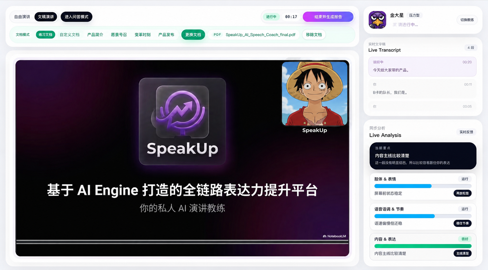
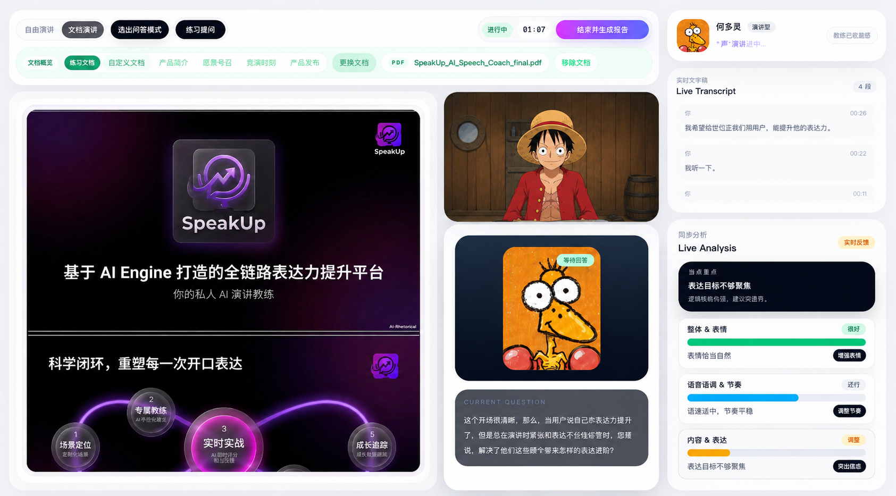
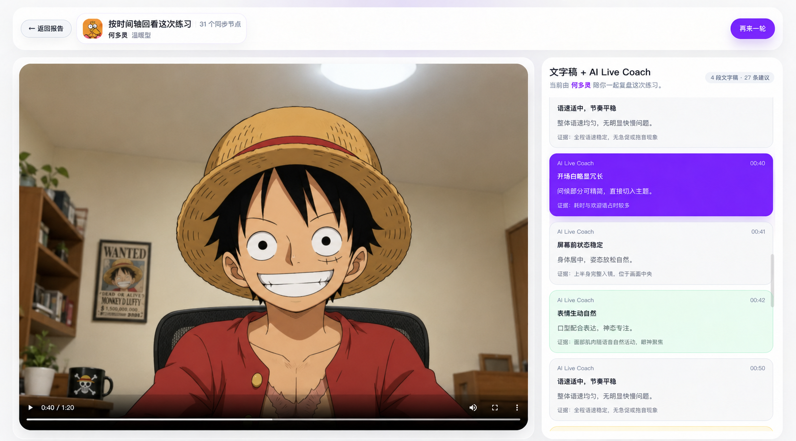
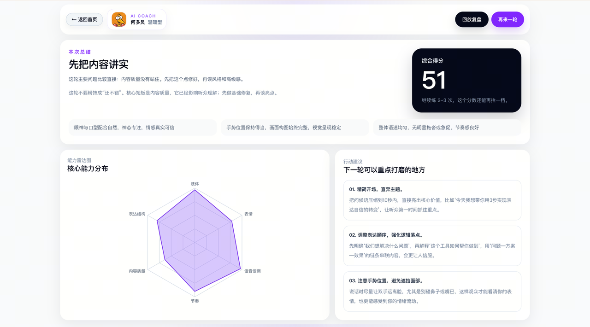

# Speak Up

English | [Simplified Chinese](README.md)

[](LICENSE)

Speak Up is a web prototype for speech training. The current codebase uses a Next.js frontend and a FastAPI backend, with support for free speech practice, document-based speaking, a realtime AI coach, AI follow-up questions, replay review, and final report generation.

## Repository Structure

```text
speak_up/
├── frontend/                  # Next.js frontend root
├── backend/                   # FastAPI backend
├── ai_coach/profiles.json     # Shared AI coach profile source for frontend and backend
├── backend/requirements.txt   # Backend Python dependencies
└── .env.example               # Runtime environment variable template
```

## Tech Stack

- Frontend: Next.js 16.2.2, React 19, TypeScript, Tailwind CSS 4, Recharts, MediaPipe Tasks Vision.
- Backend: FastAPI, Pydantic, httpx, websockets, pypdf.
- External AI: Alibaba Cloud DashScope realtime and OpenAI-compatible APIs configured through environment variables.
- Backend entrypoint: `backend/app/main.py`.
- Frontend entrypoint: `frontend/src/app/page.tsx`, which renders `SessionWorkspace` directly.

## Main Flow

1. Users open `/` or `/session`; both routes enter `SessionWorkspace`.
2. The frontend reads coach profiles from `ai_coach/profiles.json`, then users choose a scenario and either free speech or document speech mode.
3. Before entering the training workspace, users sign in with an internal beta account and password. The first successful sign-in creates a local account record automatically.
4. Document speech can use built-in practice text or uploaded PDF/Markdown files. The frontend sends the login token to `POST /api/document/extract` to extract text.
5. When practice starts, the frontend sends the login token in `Authorization: Bearer <token>` to `POST /api/session/start`. In same-origin deployments, WebSocket authentication uses a secure cookie.
6. The browser captures microphone PCM audio and camera frames, sends them to the backend continuously, and receives transcripts, Live Coach signals, Q&A events, and audio events.
7. When practice ends, the frontend tries to upload replay media, calls `POST /api/session/{session_id}/finish` with the login token, the backend accumulates daily training time and releases the active session, then the frontend navigates to `/report`.
8. The report page polls `GET /api/session/{session_id}/report` while the backend generates the report.
9. The replay page calls `GET /api/session/{session_id}/replay` and shows transcripts and coach signals on a synchronized timeline.

## UI Preview

### Main Training Page



### AI Q&A



### Replay Review



### Training Suggestions



## Star History

[](https://www.star-history.com/#ImcLiuQian/speak_up&Date)

## Local Development

Install frontend dependencies:

```bash
cd frontend
npm install
```

Start the frontend:

```bash
cd frontend
npm run dev
```

Install backend dependencies:

```bash
cd backend
python -m venv .venv
. .venv/bin/activate
pip install -r requirements.txt
```

Start the backend from `backend/`:

```bash
uvicorn app.main:app --reload
```

During local development, the frontend tries to connect to `http://127.0.0.1:8000` and `http://localhost:8000`. In public deployments, it uses same-origin reverse-proxied `/api` and `/ws` paths by default. Set `NEXT_PUBLIC_API_BASE_URL` if you need a custom backend URL. Login session token hashes, plan state, and quota data are stored in SQLite by default.

The footer survey entry shows the built-in feedback page by default. When a formal questionnaire platform URL is ready, set `SPEAK_UP_SURVEY_URL` and `/survey` will redirect to it. The WeChat entry can open an external QR code image through `SPEAK_UP_WECHAT_QR_URL`; local static builds also keep the matching `NEXT_PUBLIC_*` variables as fallbacks.

Local account and replay storage configuration:

```bash
SPEAK_UP_AUTH_DB_PATH=output/auth_data/auth.sqlite3
SPEAK_UP_INTERNAL_ACCOUNTS='[{"account":"account-id","password":"password","displayName":"Beta User"}]'
SPEAK_UP_STORAGE_DRIVER=local

# Alibaba Cloud OSS replay storage. Set SPEAK_UP_STORAGE_DRIVER=oss when enabled.
SPEAK_UP_OSS_BUCKET=...
SPEAK_UP_OSS_ENDPOINT=oss-cn-hangzhou.aliyuncs.com
SPEAK_UP_OSS_ACCESS_KEY_ID=...
SPEAK_UP_OSS_ACCESS_KEY_SECRET=...
SPEAK_UP_OSS_PUBLIC_BASE_URL=https://cdn.example.com
SPEAK_UP_OSS_PREFIX=speak-up
```

`SPEAK_UP_OSS_PUBLIC_BASE_URL` can be empty. When it is empty, the backend generates short-lived signed replay URLs, which works well for private buckets.

## Public Deployment

Public domain access requires DNS, ECS security groups, HTTPS, and reverse proxy configuration. The repository includes reference configuration:

- Nginx: `deploy/nginx/speakupcoach.cn.conf`
- systemd: `deploy/systemd/speak-up-backend.service`, `deploy/systemd/speak-up-frontend.service`
- Guide: `deploy/README.md`

`speakupcoach.cn` and `www.speakupcoach.cn` must resolve to the Alibaba Cloud ECS public IP. Public training pages must use HTTPS; otherwise browsers will not grant camera and microphone permissions.

## Environment Variables

Before running the real AI path, prepare environment variables from `.env.example`. The backend reads from the shell environment. If Next.js should read frontend variables from a file, put `NEXT_PUBLIC_*` values in `frontend/.env.local`. The core required variable is:

```bash
DASHSCOPE_API_KEY=...
```

Main configuration groups:

- ASR: `ALIYUN_REALTIME_ASR_MODEL`, `ALIYUN_REALTIME_ASR_URL`, `ALIYUN_REALTIME_ASR_SILENCE_DURATION_MS`.
- Live Coach: `ALIYUN_OMNI_COACH_MODEL`, `ALIYUN_OMNI_COACH_URL`, `ALIYUN_OMNI_COACH_SILENCE_DURATION_MS`.
- Q&A: `ALIYUN_QA_OMNI_MODEL`, `ALIYUN_QA_BRAIN_MODEL`, `QA_MAX_QUESTION_TOPICS`, `QA_MAX_FOLLOW_UPS_PER_QUESTION`.
- Report: `REPORT_WINDOW_BUILD_INTERVAL_SECONDS`, `ALIYUN_REPORT_WINDOW_MODEL`, `ALIYUN_REPORT_BRAIN_MODEL`.

## Quality Checks

The repository provides a frontend lint command:

```bash
cd frontend
npm run lint
```

The usual backend validation path is to start FastAPI and check `/health`, `/api/session/start`, and the WebSocket session flow.

## License

This project is licensed under the [MIT License](LICENSE).
