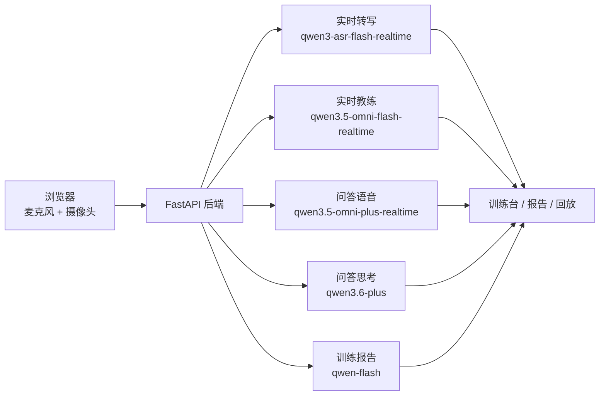

# Speak Up

简体中文 | [English](README.en.md)

[](LICENSE)

Speak Up 是一个 AI 演讲训练 Web 原型。它把实时转写、表达反馈、AI 追问、视频回放和训练报告串成一条练习流程，帮助用户把每一次开口都变成可复盘的反馈。

## 功能概览

- 自由演讲和文档演讲两种训练模式。
- 浏览器采集麦克风和摄像头，后端实时生成文字稿和教练反馈。
- AI 问答模式会基于训练内容追问、评价回答，并支持语音交互。
- 训练结束后生成结构化报告，回放页同步展示视频、文字稿和关键反馈。

## 仓库结构

```text
speak_up/
├── frontend/                  # Next.js 前端
├── backend/                   # FastAPI 后端
├── ai_coach/profiles.json     # AI 教练画像
├── demo_image/                # README 截图
└── .env.example               # 环境变量示例
```

## 界面预览

### 主训练页


### AI 问答


### 回放复盘


### 训练建议


## AI 链路



真实 AI 链路共用 `DASHSCOPE_API_KEY`。下面这些模型名都有默认值，只有想替换模型时才需要额外配置对应变量。

| 功能 | 默认模型 | 用途 | 可选环境变量 |
| --- | --- | --- | --- |
| 实时转写 | `qwen3-asr-flash-realtime` | 把麦克风音频转成实时文字稿 | `ALIYUN_REALTIME_ASR_MODEL` |
| 实时教练 | `qwen3.5-omni-flash-realtime` | 根据音频和画面给出口语、节奏、肢体反馈 | `ALIYUN_OMNI_COACH_MODEL` |
| 问答语音 | `qwen3.5-omni-plus-realtime` | AI 面试官语音对话和追问 | `ALIYUN_QA_OMNI_MODEL` |
| 问答思考 | `qwen3.6-plus` | 整理材料、生成问题、评价回答 | `ALIYUN_QA_BRAIN_MODEL` |
| 问答 TTS | `qwen3-tts-instruct-flash-realtime` | 生成 AI 面试官语音 | `ALIYUN_QA_TTS_MODEL` |
| 报告窗口 | `qwen-flash` | 分段整理训练过程中的表现 | `ALIYUN_REPORT_WINDOW_MODEL` |
| 最终报告 | `qwen-flash`，兜底 `qwen-plus-latest` | 汇总整场训练报告和建议 | `ALIYUN_REPORT_BRAIN_MODEL`、`ALIYUN_REPORT_BRAIN_FALLBACK_MODEL` |

## 本地运行

后端不会自动读取 `.env` 文件，请把变量放到当前 shell 或你的进程管理器里。最少需要：

```bash
export DASHSCOPE_API_KEY=sk-...
export SPEAK_UP_INTERNAL_ACCOUNTS='[{"account":"demo","password":"change-me","displayName":"Demo User"}]'
```

`DASHSCOPE_API_KEY` 用于阿里云 DashScope 模型调用。`SPEAK_UP_INTERNAL_ACCOUNTS` 是本地内测账号池；不要把真实账号密码提交到仓库。

启动后端：

```bash
cd backend
python -m venv .venv
. .venv/bin/activate
pip install -r requirements.txt
uvicorn app.main:app --reload
```

启动前端：

```bash
cd frontend
npm install
npm run dev
```

打开 `http://localhost:3000/login`，用你在 `SPEAK_UP_INTERNAL_ACCOUNTS` 里配置的账号密码登录。前端默认连接 `http://127.0.0.1:8000`；如果后端地址不同，再配置 `NEXT_PUBLIC_API_BASE_URL`。

## 质量检查

前端 lint：

```bash
cd frontend
npm run lint
```

后端可以先启动 FastAPI，再检查 `/health`、登录、训练开始和 WebSocket 会话链路。

## License

This project is licensed under the [MIT License](LICENSE).

## Star History

[](https://www.star-history.com/#ImcLiuQian/speak_up&Date)
